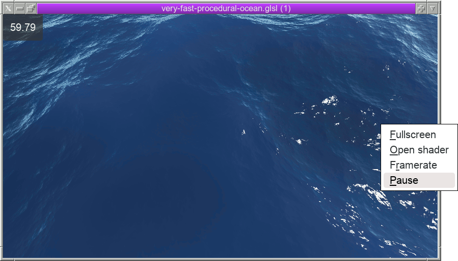

Run in a window:

    $ gtk4_shadertoy test/data/afl_ext/very-fast-procedural-ocean.glsl

Right click for menu or

kbd               | desc
----------------- | -------------
<kbd>f</kbd>      | fullscreen
<kbd>r</kbd>      | print the current framerate to stdout
<kbd>esc</kbd>    | close window
<kbd>space</kbd>  | pause
<kbd>ctrl-o</kbd> | open another shader

Run fullscreen (-f) and show an FPS overlay (-r):

    $ gtk4_shadertoy -fr < file.glsl

Put the app on the lowest window layer, ignore kbd/mouse input:

    $ gtk4_shadertoy -fr -b file.glsl

To exit the app in such a wallpaper mode, you'll need to kill it
either sending WM_DESTROY, or via the TERM signal.

To make the wallpaper mode work in fvwm3, add to ~/.fvwm/config:

~~~
Style * EWMHUseStackingOrderHints
Style gtk4_shadertoy_below WindowListSkip
~~~

or, by just

    Style gtk4_shadertoy_below StaysOnBottom, Sticky, WindowListSkip

## Features & limitations

* a tiny gtk4 app;
* no web browser dependency;
* remote control via a socket;
* X11 only, no wayland support yet;
* renders only a subset of standalone shaders so far, i.e., if a
  shader depends on a texture specific to shadertoy.com it won't
  work.

## Compilation

~~~
$ sudo dnf install gtk4-devel
$ make
~~~

`_out/gtk4_shadertoy` should be the result.

## Advanced control

Run in a window, but also accept commands via a socket:

~~~
$ gtk4_shadertoy test/data/TAKUSAKU/fire-glass.glsl -p 2023
** Message: 13:56:58.520: Listening on localhost:2023
~~~

Then,

~~~
$ telnet 127.0.0.1 2023
Trying 127.0.0.1...
Connected to 127.0.0.1.
Escape character is '^]'.
help
200 help; available commands: pause, load file.glsl, quit
pause
200 pause
pause
200 pause
load ~/lib/software/alex/gtk4_shadertoy/test/data/Kali/star-nest.glsl
200 load
quit
200 quit
Connection closed by foreign host.
~~~

Remote controlling using netcat:

~~~
$ echo load ~/some/file.glsl | nc 127.0.0.1 2023
200 load
~~~

## Fetching a shader without an API key

~~~
$ npm -g i json
$ ./shader_fetch tsBfDw | _out/gtk4_shadertoy
~~~

or

    $ ./shader_fetch https://www.shadertoy.com/view/tsBfDw | _out/gtk4_shadertoy

## License

MIT for `gtk4_shadertoy.c` & `x11.[ch]`.

`gtkshadertoy.[ch]` are ripped from gtk4-demo app and are LGPLv2.1+.

`test/data/*` files are downloaded form shadertoy.com.
